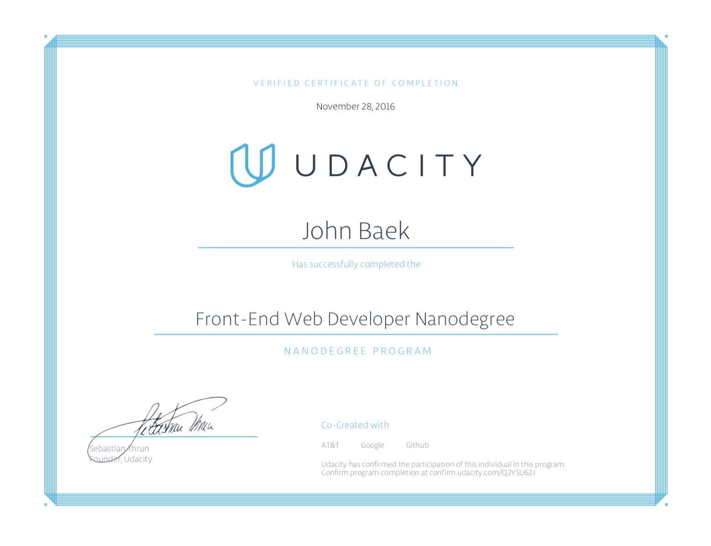
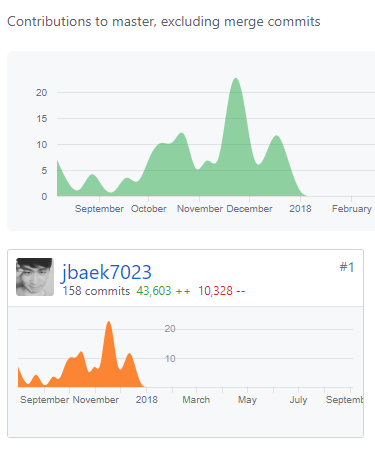
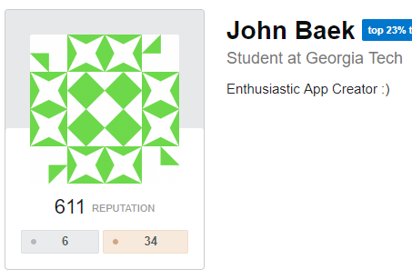
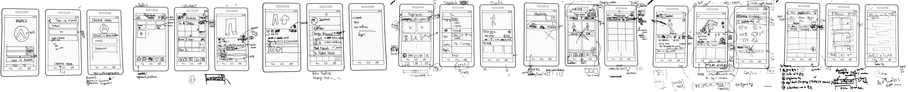

  

---
Stylee is Social Network Platform which allows user to organize and socialize around your fashion style and clothing. 

This is NOT a school project but a project for my interest.
&nbsp;

## Demo


Youtube Link: [click](https://youtu.be/5ytDSnle2zQ)

## Story
**I was thinking about what will be the next Facebook or Instagram in next 4 years.** Every day before I went to bed, I wrote down at least one idea of the next social network service or next generation of mobile apps would be. And I thought I'd make an app for myself. I wasn't very well dressed, so I thought I'd make an app that would help me dress well. 

In short this took me to...

- Wrote **65+ APIs** and **56+ pages**(screens) in **4 months**
- Finished 3 nanodegrees (Udacity) and 9 Udemy courses in 8 months
- Attended 3 hackerthon, and met brilliant people the durinre (Some people had same passions and industry leads).
- Got StackOverflow 600+ reputation (I'm not sure if this is something that I should be proud of, but I like the number)
- Found building a software is much fun than I thought in my university. 🙂

(code), (FE code), StackOverflow
(AIND)(FSND)(FEND)

   

   


## Interviews, Business Model, UI/UX, Tech Stack Research (March 2016 - Aug 2017) 

I interviewed 13 people for idea pitching and 3 people for UI testing. 

**Low Fidality Sketch:**

   


**Finalised Tech Stacks:**
 
- Django / Phython
- React/Redux/JavaScript/react-navigation/ 
- Tensorflow for R-CNN training
- OpenCV2
- getStream.io for Newsfeed and Notification (Got this idea from Hackerthon - Thanks Kyung-Hoon)

### Final Page Hirearchy
Total 30 screens.

```
Newsfeed Page: Newsfeed Main, Weekly Top 100 page
Style page: Style page, Category page, Bookmark page
Wardrobe page: list of posts by the type of clothes
Notification: Notification Main Page
Settings Page: Terms/Condition, Privacy Policy, Change Password, Sign Out
Sign-Up Page: ssdfssdfsdf
Login-Page: Social Login, Main Login
```


## Key Takeaways (Draft - will rewrite soon)
#### Back-End (Django / Python)
Testing: Need to have QA system
Dependency: Should be careful when you import new libraries. And make sure 
... From this point, I got interested in DevOps field.

#### Front-End
React Component: Make as many components as you can. It can make you code more readable and manageble. There is no over-engineering if you're building components... Keep your screen 
Testing: More than enough... 
EsLint more properly...
Libraries.. depedency. 
Choose MobX over Redux. 
Expo. 

#### AI / Data Analysis
Data Wrangling: This takes much more time than I think. 
Data Analysis: there were 32 types of clothes I defined under 5 different ... I had to do some interviews + questions on Quora. It definetely helped but ... 
AI: I used R-CNN to detect the type of clothes. It's difficult to 

#### Project Management / Software Engineering / Project Design
Design is important. And should make a sprint. Had to use Agile
It's difficult to change project design especially if you're building something by yourself. Make sure you have a high fidality with Sketch/InVision at least. If you have low-fidality on your hand and build it, you'll likely end up having similar UI with your low-fi design. So waterfall for design and deveolopment stage + development + stage.
Front-End took 4x times than Back-End. As your system grows, but back-end takes much more time as you scale.
Had to more prioritize the works. Some times I too much focused on such functionality like 'touch navigation button for 
Should have finite Business Model so that at least I can pay for the AWS server fee.
Trello/Asana

### Business

If you think "Ad" will give you dollars and don't think more about back-up plan, it's very difficult to sustain your business. Your app is not Google. 

## Next Step

I've learend how to build mobile app with React Native and Django from scratch!

- I'm going to experience with scalable back-end system like Facebook, Pinterest, or Instagram. Chef and Jenkins are something that I'm learning from last summer.

- I'm interested in managing and automating development pipeline. 

- I'm going to build 20 mobile apps for the next 5 years to improve Django, React, JavaScript, Python skills.

- I think I should start Median. I just made an account: https://medium.com/@johnbaek 

## Online courses for this project

Udacity (Fundamental / Practical): 

- Artificial Intelligence Nanodegree, Full Stack Web Developer ND, Front-End ND (Checkout my projects from AIND, FSND, FEND from my repo)

Udemy (Skill Specific): 

- Coding for Entrepreneur, TweetMe, Django Core (Justin Mitchell) 
- Ultimate Beginner Guide to Django (Nick Walter)
- Build Your Own Backend REST API (Mark Winterbottom)
- Advanced React and Redux, Modern React with Redux, Complete React and Redux Course, React Native: Advanced Concepts (Stephen Grider)

Youtube Tutorials (Technical Know-How): 

- Search ReactConf, PyCon, and many more.
