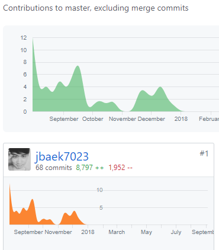

  

---
Stylee is Social Network Platform which allows user to organize and socialize around your fashion style and clothing. 

This is NOT a school project but a project for my interest. This project is totally on my own. It was a lot of fun and I just enjoyed the learning process throughout. 
&nbsp;

## Demo


<!---->

- This video (Core): [LINK](https://youtu.be/Y_94Z3VHYHo)

+ More demo (Sign-Up page): [LINK](https://youtu.be/Leog1Ldyycg)

+ Old Demo: [click](https://youtu.be/5ytDSnle2zQ)

## Story
**I was thinking about what will be the next Facebook or Instagram in next 4 years.** Every day before I went to bed, I wrote down at least one idea of the next social network service or next generation of mobile apps would be. And I thought I'd make an app for myself. I wasn't very well dressed, so I thought I'd make an app that would help me dress well. 

In short this took me to...

- Wrote **65+ APIs** and **56+ pages**(screens) in **4 months**
- Finished 3 nanodegrees (Udacity) and 9 Udemy courses in 8 months
- Attended 3 hackerthon, and met brilliant people the durinre (Some people had same passions and industry leads).
- Got StackOverflow 600+ reputation (I'm not sure if this is something that I should be proud of, but I like it)
- Read bunch of deep learning papers for Regional Convolutional Neural Network. (When I built this app, R-CNN wasn't popular and still under a research. It was often called as 'Darknet')
- Found building a software is much fun than I thought in my university. 🙂

   

   
&nbsp;

## Interviews, Business Model, UI/UX, Tech Stack Research

I interviewed 13 people for idea pitching and 3 people for UI testing. 

**Low Fidality Sketch:**

   

**Finalised Tech Stacks:**
 
- Django / Phython
- React/Redux/JavaScript/react-navigation/ 
- Tensorflow for R-CNN training
- OpenCV2
- getStream.io for Newsfeed and Notification (Got this idea from Hackerthon - Thanks Kyung-Hoon)

### Final Page Hirearchy
Total 30 screens.

```
Newsfeed Page: Newsfeed Main, Weekly Top 100 page
Style page: Style page, Category page, Bookmark page
Wardrobe page: list of posts by the type of clothes
Notification: Notification Main Page
Settings Page: Terms/Condition, Privacy Policy, Change Password, Sign Out
Sign-Up Page: ssdfssdfsdf
Login-Page: Social Login, Main Login
```


## Key Takeaways for my next app
#### Back-End (Django / Python)
- Testing: Need to have QA environment for testing - Use TravisCI and Robot (Need TDD for documentation and maintainable system)
- Dependency: Should be more careful when you import new libraries
- Authorization: Better to write registration/login process by myself. It's risky to rely on a specific library for social login and basic login. So I ended up writing all auth screens from scratch.
- Use Radis Cache for populating aggregated(ranking) result. It's actually very easy and powerful.
- I chose Django because Python has much more machine learning libraries than Ruby or Node.js.

#### Front-End
- React: Make sure keep your screen simple using Components. It can make your code more readable and manageble. 
- Testing: More than enough to 
- Style: You don't want to fix 1,000 lines of codes in the end. Set up ESLint in advance and try to write a clean code.
- Redux: Redux is immutable, which means it's hard to build a product quickly. MobX will be better choice.
- Expo: Expo takes too much memory space.
- Pixel Crop: There was no great cropping library available in RN
- File Transfer: RN Blob is not supported for both platforms. It can send the packets for file/photo, but it doesn't clean the cache gracefully. Need to eject Expo and use other native libraries.
- PureComponent: Don't use pure component all time. Shallow copy is expensive. If it rerender every second, better to use Component.
- DL model implmentation: Still on going 

#### AI / Data Analysis
- Data Scrapping / Wrangling: Finding 10,000 data of different types of clothes were ok, but tagging and making key points of each object in the photo was not fun.
- Data Analysis: 
- AI: I used R-CNN to detect the type of clothes.  

#### Project Management / Software Engineering / Project Design
- Prototyping: Hands-on prototyping is important. Use Sketch and InVision to demo your project.
- Planning/Management: Use Asana or Trello to manage your project. Set a sprint every week (or 2 weeks).
- Planning: Front-End takes 4x times than Back-End. But back-end will take much more time as it scales.
- Business Model: if you think Ads will bring your revenue and don't have any back-up plan, how are you going to run your business without money in the early stage?

## Next Step

- I'm going to build 15 mobile apps for the next 5 years to improve my Django, React, JavaScript, Python skills.

- Experience with a scalable systems using Chef and Jenkins. 

- Learn more about low-level system design stuff: RPC, Load Balancer and so on. I know how it works.

- I think I should start Median. I just made an account: https://medium.com/@johnbaek 

## Online Courses

Udacity (Fundamental / Practical): 

- Artificial Intelligence Nanodegree, Full Stack Web Developer ND, Front-End ND (Checkout my projects from AIND, FSND, FEND from my repo)

Udemy (Skill Specific): 

- Coding for Entrepreneur, TweetMe, Django Core (Justin Mitchell) 
- Ultimate Beginner Guide to Django (Nick Walter)
- Build Your Own Backend REST API (Mark Winterbottom)
- Advanced React and Redux, Modern React with Redux, Complete React and Redux Course, React Native: Advanced Concepts (Stephen Grider)

Youtube Tutorials (Technical Know-How): 

- Search ReactConf, PyCon, and many more.

And of course, some documentations.